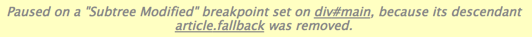
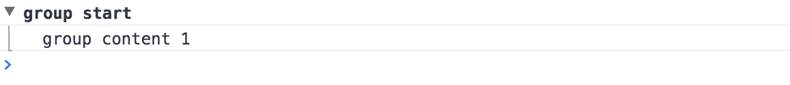
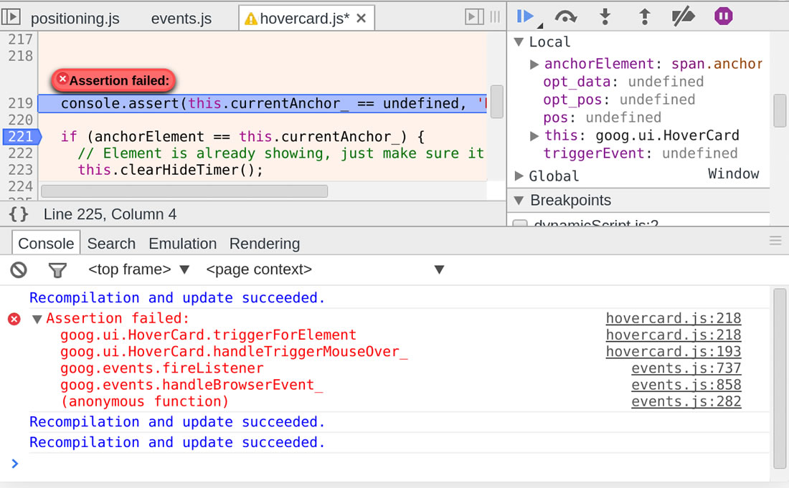
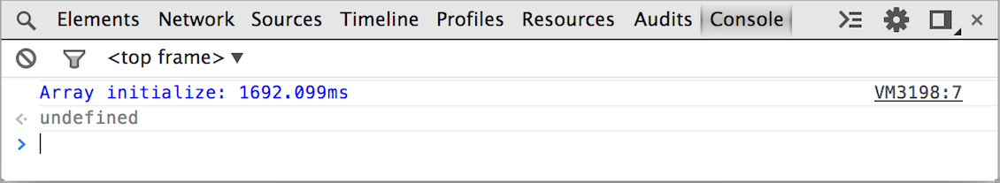
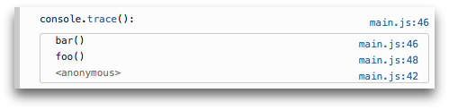
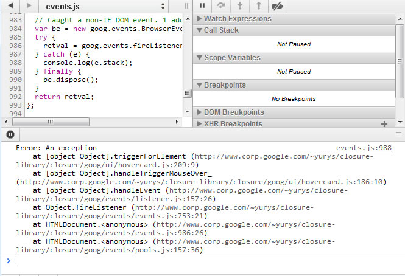
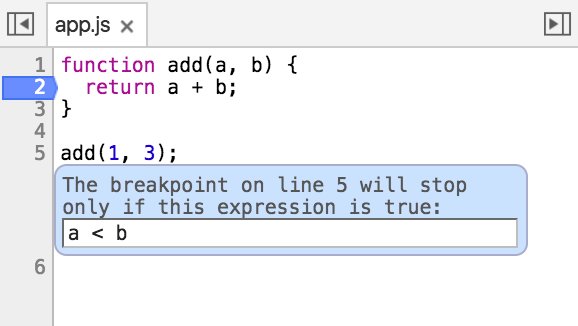
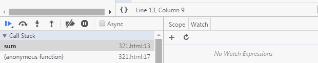
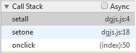
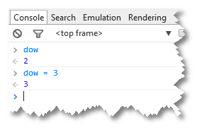

# Chrome调试相关

Chrome调试工具是日常项目中常用到的，但面对`Command + Shift + i`(window:`F12`)开启调试面板，总有些不被知晓的功能被遗漏。本着工欲善其事，必先利其器的想法，扒点历史存货，也从官网系统学习一下Chrome较为完善的功能.

## Elements Panel

所见即所得,主要用于显示编辑`html`及`style`样式

**DOM Inspect**:

1. 鼠标选中，右键`inspect`
2. 菜单底部可快速定位父级元素
3. 选中元素`Enter`,then press `Tab`可快速选择属性，进行编辑


**DOM样式修改**：

1. `html`双击修改，`style`单击修改，`tab`or `enter`确认修改
2. 查看历史修改，可通过以下操作：
   * In the **Styles** pane, click on the file that you modified. DevTools takes you to the **Sources** panel.
   * Right-click on the file.
   * Select **Local modifications**.

演示地址：

[历史修改查看](https://developers.google.com/web/tools/chrome-devtools/iterate/inspect-styles/animations/revisions.mp4)


**Set DOM breakpoints**

按照`DOM Inspect`提示选中元素后，可右键设置`DOM breakpoints`：

1. `Subtree Modifications`: 加在父级上的断点，用来监听子元素的内容增删
2. `Attribute Modifications`:加在元素上的断点，用来监听元素的属性变化
3. `Node Removal`:加在元素上的断点，用来监听元素是否被删除

断点事件触发，会有如下提示



> 以上断点虽然都在DOM元素上添加，实则仍为监听JS


## Console Panel

*Shortcut*: Press `Ctrl+Shift+J` (Windows / Linux) or `Cmd+Opt+J` (Mac).

Console：输出控制台，前端调试后花园，内容输出显示，或者直接执行`javascript`代码

**Write Console**

1. `javascript`文件中执行`console.log('some function or string')`

2. 控制台直接输入命令执行

   ​


**Console API**

1. `console.group`:内容输出成组

   ```javascript
   // 输出在控制台的内容成组,可实现多层级，以及折叠效果（需要配合console.groupCollapsed）
   console.group('group start'); //group开始
   console.log('group content 1'); // group 内容1
   ... // group 其他内容
   console.groupEnd(); //group结束
   ```

   效果如下: 

2. `console.error()`:输出错误

   ```javascript
   function connectToServer() {
       console.error("Error: %s (%i)", "Server is  not responding",500);
   }
   connectToServer();
   ```

3. `console.warn()`:输出警告

   ```javascript
   if(a.childNodes.length < 3 ) {
       console.warn('Warning! Too few nodes (%d)', a.childNodes.length);
   }
   ```

4. `console.assert`:输出断言,不影响后续的函数执行,断言可以viewexception stack trace.

   

   > Writes an error message to the console if the assertion is false. If the assertion is true, nothing happens.
   >
   > [MDN - Console.assert()](https://developer.mozilla.org/en-US/docs/Web/API/console/assert)

   ```
   console.assert(list.childNodes.length < 500, "Node count is > 500");
   ```


1. `console.table`:表格

   ［官方示例](https://developers.google.com/web/tools/chrome-devtools/debug/console/structured-data?hl=en)

2. `console.time(arg)`,`console.timeEnd(arg)`:查看函数执行时间。

   ```
   console.time("Array initialize");
   var array= new Array(1000000);
   for (var i = array.length - 1; i >= 0; i--) {
       array[i] = new Object();
   };
   console.timeEnd("Array initialize");
   ```

   结果：

   

3. `console.trace`可追踪执行路径

   ```
   function foo() {
     function bar() {
       console.trace();
     }
     bar();
   }

   foo();
   ```

   The output in the console looks something like this:

    


完整Console文档在这里：[Console API Reference](https://developers.google.com/web/tools/chrome-devtools/debug/console/console-reference?hl=en)

**Console Format**

1. 基本Format.如上，内容输出可进行格式化输出.Console支持的输出列表：

   | Specifier | Output                                   |
   | --------- | ---------------------------------------- |
   | %s        | Formats the value as a string            |
   | %i or %d  | Formats the value as an integer          |
   | %f        | Formats the value as a floating point value |
   | %o        | Formats the value as an expandable DOM element. As seen in the Elements panel |
   | %O        | Formats the value as an expandable JavaScript object |
   | %c        | Applies CSS style rules to the output string as specified by the second parameter |

2. 格式化输出CSS样式

   ```
   // 控制台可直接输出带有样式的内容
   console.log("%cThis will be formatted with large, blue text", "color: blue; font-size: x-large");
   ```

   ​

3. 格式化DOM元素为**对象**:

   > By default, DOM elements are logged into the console as representation of their HTML, but sometimes you want to access the DOM element as JavaScript object and inspect its properties. You can use the `%o` string specifier to do that (see above), or use `console.dir` to achieve the same:

   ```
   console.dir(document.body.firstElementChild)
   ```

   ​


**Print stack traces**

以上`console.trace`可实现路径追踪，在报错中，我们可以通过`Error`输出打印

1. `Error.stack`:error 的`stack`属性可以输出执行路径

    

   ​

*Tips*:

1. 控制台输入`clear()`可快速实现清屏
2. 同上清屏功能，可以在自己的JS代码中执行`console.clear()`,解除控制台各种问题


## Source Panel

Source：顾名思义，加载的资源这里都能找得到。此部分主要介绍断点。

**Set Breakpoint**

1. 方法一：Source内容区设置

   - 主体内容区域需要设置断点的行号前点击，对应的行即设置好了。以此类推。
   - 刷新浏览器，根据页面逻辑以此会在断点处暂停执行，用于`debug

2. 方法二：`js`文件中设置

   * 在`js`文件中需要执行断点操作的code line前加上`debugger`

     ```javascript
     function sum(a, b){
       debugger;
       return a + b;
     }
     ```

**Breakpoint conditional**断点执行条件

右键设置的断点，选择`Edit breakpoint`输入执行断点的条件

 

**Breakpoint Step**

 

* Pause/Resume script execution：暂停/恢复脚本执行（程序执行到下一断点停止）。
* Step over next function call：执行到下一步的函数调用（跳到下一行）。
* Step into next function call：进入当前函数。
* Step out of current function：跳出当前执行函数。
* Deactive/Active all breakpoints：关闭/开启所有断点（不会取消）。
* Pause on exceptions：异常情况自动断点设置。

**Call Stack**

可以通过勾选`Async`实现异步查找事件依赖关系，方便`debug`。官方建议避免使用匿名函数。

> Near the top of the sidebar is the **Call Stack** section. When the code is paused at a breakpoint, the call stack shows the execution path, in reverse chronological order, that brought the code to that breakpoint. This is helpful in understanding not just where the execution is *now*, but how it got there, an important factor in debugging.
>
> [The call stack](https://developers.google.com/web/tools/chrome-devtools/debug/breakpoints/step-code?hl=en)

 

> An initial onclick event at line 50 in the **index.html** file called the`setone()` function at line 18 in the **dgjs.js** JavaScript file, which then called the `setall()` function at line 4 in the same file, where execution is paused at the current breakpoint.

可以通过右键在对应的脚本（如第三方）文件中设置`blackbox `关进小黑屋，防止迷惑`debug`.官方是通过`tools`的`setting`进行全局设置。

**Data manipulation**更改执行数值

暂停break，控制台输出需要变更的值，强制更改值即可继续按照所需执行. 


针对Workspaces 和 Sourcemaps开启的权限，见下。

[Set Up Persistence with DevTools Workspaces](https://developers.google.com/web/tools/setup/setup-workflow)

[Set Up CSS & JS Preprocessors](https://developers.google.com/web/tools/setup/setup-preprocessors?#debugging-and-editing-preprocessed-content)


参考链接

* [Chrome DevTools官方文档](https://developers.google.com/web/tools/chrome-devtools/?hl=en)
* [Console API Reference](https://developers.google.com/web/tools/chrome-devtools/debug/console/console-reference?hl=en)


* [一探前端开发中的JS调试技巧](http://mp.weixin.qq.com/s?__biz=MjM5MTA1MjAxMQ==&mid=2651220284&idx=1&sn=26eab0ec27163e7cb020fd95ac0dfaee&scene=23&srcid=0501P3Mz7G1wVWJkrmqiMLBX#rd)