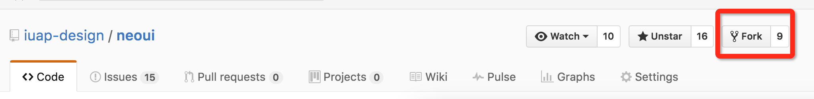
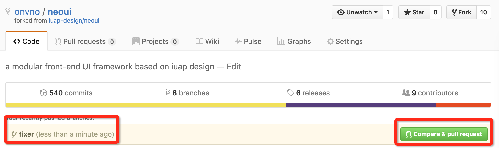
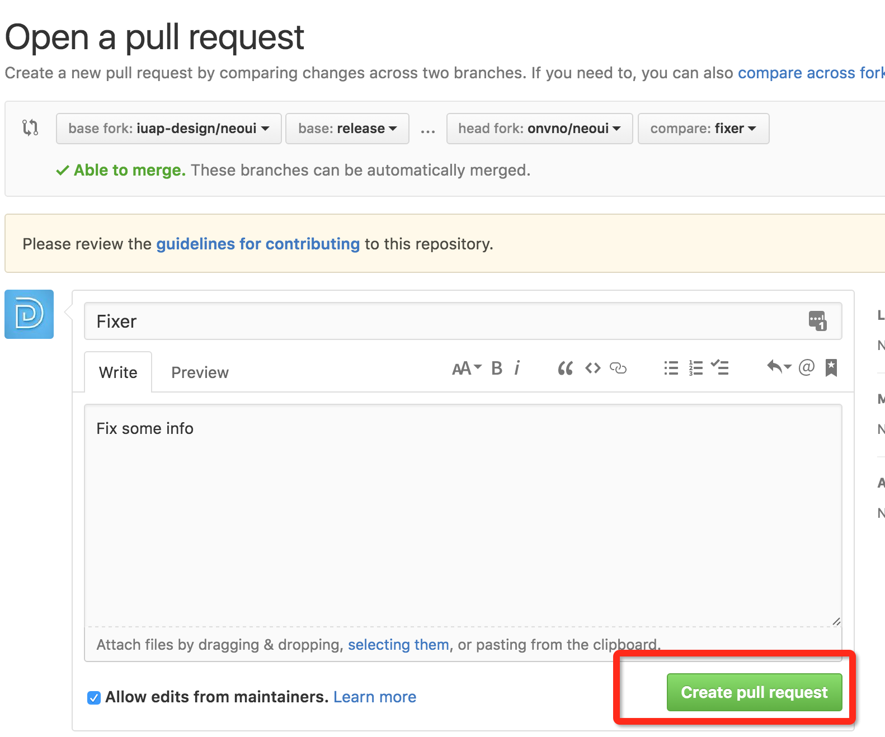

# Pull Request流程

以 [neoui](https://github.com/iuap-design/neoui) 仓库为例：

1. Fork仓库到个人Respository目录：进入仓库，点击`Fork`

    

2. Clone到本地

   ```
   $ git clone git@github.com:onvno/neoui.git
   ```

3. 创建分支

   ```
   $ git checkout -b fixer
   ```

4. 修改后提交

   ```
   $ git add .
   $ git commit -m "fix:some bug"
   $ git push origin fixer
   ```

5. 提交`pull request`:登陆github,进入`fork`后的仓库，切换到新提交的`fixer`分支，点击右侧绿色按钮`Compare& pull request`

    

6. 添加注释信息，确认提交

 